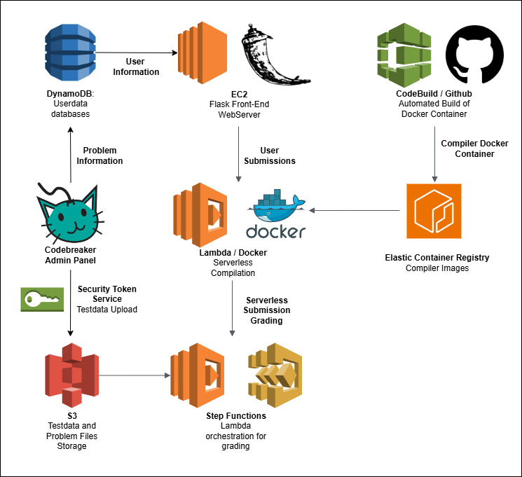

# Codebreaker Online Judge

## Introduction

Codebreaker is the official platform for Singapore Informatics Olympiad training and contests. It is home to 2,000 problems and over 8,000 users, and has performed **national team selection** for the International Olympiad of Informatics teams in Singapore and Indonesia.

The primary motivation for Singapore’s migration to Codebreaker is **lowering operating costs**. Despite having run for over 6 years and having graded hundreds of thousands of submissions, the total operational cost of Codebreaker is under $3000.

Codebreaker Contest System is a fork of the Codebreaker architecture that serves to allow for **easy and independent** usage of Codebreaker to run contests. In that way, Codebreaker Contest serves to be a more **cost-efficient** and more user-friendly version of the gold standard of contest organization and management, CMS. It is available at this link: [https://github.com/dvdg6566/codebreaker-contest-manager/](https://github.com/dvdg6566/codebreaker-contest-manager/).

## Codebreker Statistics

As of time of writing (Feb 2026), here are the statistics for [Codebreaker](https://codebreaker.xyz) (main site).

- Codebreaker receives an average of 400,000 to 500,000 monthly page requests (Excluding AI crawlers). 
- Codebreaker has graded a total of 800,000 submissions.
- Codebreaker has 8,000+ registered users, coming from a 100+ different countries
- Codebreaker has a total of 2,000+ different problems, coming from a mixture of public sources and the Singapore training system.

## Codebreaker Infrastructure Overview

Codebreaker runs on Amazon Web Services’ **Serverless Architecture** for compilation and grading of submissions. By abstracting away all of the heavy computation from the front-end web server, the web server thus only needs the resources necessary to support simple database API call operations and Flask hosting. This also avoids the need to **over-provision** resources, like having a large static server with a large number of workers running to perform grading.

To support problems with hundreds of testcases, we use Express Step Functions to orchestrate our Lambda workflow. This supports the **concurrent invocations** of hundreds of independent Lambda graders that will grade each of the testcases. This allows for extremely quick grading times for an optimal user interface. As per latest benchmark, the problem `housevisit` with 562 testcases is graded in about 11-12 seconds.

## Architecture

2. The front-end web server is a Flask server running on an **AWS Elastic Compute Cloud (EC2)** instance. The server is deployed with **Gunicorn** and reverse proxied with **Nginx**.
3. Codebreaker’s grading is performed serverlessly through an **AWS Step Functions** and **AWS Lambda** workflow. The steps are as follows:
   1. The submission is initialized and an entry created in DynamoDB.
   2. The submission is compiled with a custom **Ubuntu OS Docker container** that has GCC and Lambda installed.
      a. Lambda relies on the container being built in the user’s **Elastic Container Repository (ECR)** instance. As such, CodeBuild will get the set-up scripts from Github and compile the container, before uploading it to ECR.
      b. The same tech stack is also used for compilation of checkers. As such, Codebreaker supports `testlib.h`, the industry-standard Competitve Programming checker and grader library.
   3. Step Functions will concurrently invoke **wrapper Lambda functions** for testcase grading. This supports separation of permissions, allowing Lambda to function as a Sandbox for code execution before the wrapper will update the database. Note that the wrapper can have extremely **low memory allocation**, allowing for negligible compute costs.
   4. When all invocations have completed, a lambda function aggregates the testcase results and provides a final score.
4. The main Codebreaker data storage uses **AWS DynamoDB** as a serverless database that stores user and problem data.
   1. Website functionality is provided through DynamoDB **Global Secondary Indexes** for fast and robust queries.
5. **AWS Simple Storage Service (S3)** is used for file storage for testdata and submissions.
   1. **S3 Lifecycle rules** are used to transfer testcases from older problems to infrequent access storage tier to save costs.
   2. Testdata is uploaded through the admin panel. For each problem, an **ephemeral IAM role** is created with appropriate permissions that allows `PutItem` access to a specific folder of the **testdata bucket**. **Security Token Service (STS)** is used to generate temporary AWS credentials that are passed to the front-end and uses the front-end SDK to upload the files. This allows for direct uploads to S3 with built-in **multipart uploads**.
6. Contest announcements and notifications of incoming clarifications (for admins) is done through the use of **AWS API Gateway**. Front-end clients make SDK calls to an API Gateway **WebSocket endpoint**, which will be used to invoke the relevant notifications through AWS Lambda. This abstracts away web socket connections from the front-end server.
7. User accounts and authentication are handled strictly through **Google (Gmail) authentication**.

## Checker Documentation

#### without `testlib.h`

If you are not using `testlib.h`, checker is called with $3$ arguments in this order:

- input file (`argv[1]`)
- participant output file (`argv[2]`)
- jury output file (`argv[3]`)

The checker should output a real number between $0$ and $1$. The score will be multiplied by the subtask score.

#### with `testlib.h`

If you are using `testlib.h`, the following is behaviour of the modified `testlib.h` (modification is in `InStream::quit` function starting at line 2596)

- `_ok`: prints 1
- `_wa`: prints 0
- `_pe`: prints 0
- `_fail`: prints nothing (checker fail)
- `_dirt`: prints 0
- `_points`: prints custom error message that you specified. Example use is `quitf(_points,"%.2f\n",0.69420);` to give $69.42\%$ of the subtask score
- `__unexpected_eof`: prints 0
